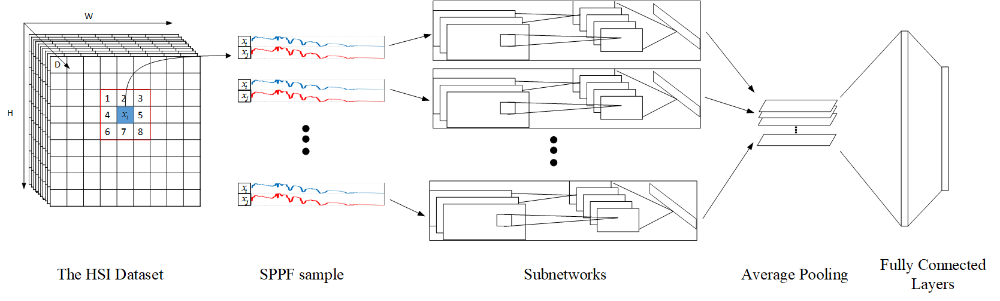

## SPPF for HSI classification

### Abstract
During recent years, convolutional neural network (CNN) based methods have been widely applied to hyperspectral image (HSI) classification by mostly mining the spectral variabilities. In particular, the scarcity of training labels motivates the development of pixel pair features (PPF) for classification networks. However, the spatial consistency in HSI is largely ignored in PPF. 

Alternatively, we propose an improved, multi-stream convolutional neural network based on new spatial pixel pair feature (SPPF) to exploit both the spatial contextual information and spectral information. Unlike previous PPF features, SPPF is constructed by creating pixel pairs with deterministic spatial choices limited to adjacent pixel locations with fixed orders. Furthermore, the classification is achieved via a series of sub-networks (streams) with our proposed late fusion layers: an averaging pooling layer for rotation invariance and two fully connected layers for scoring. 

Additionally, the proposed multi-stream late fusion network outperforms existing ones without requiring carefully handcrafted network configurations. 
Overall, experimental results on three publicly available datasets demonstrate the success of the proposed SPPF based network.

### Model

### Code
For reproducing the results, please feel free to download [SVM](https://www.csie.ntu.edu.tw/~cjlin/libsvm/) and [ELM](http://www.ntu.edu.sg/home/egbhuang/) and use the hyper-parameter settings described in our paper. 
For deep models, configurations for PPF, BsNet, ssCNN and SPPF are available on [github](https://github.com/hijeffery/HSI-SPPF/tree/master/code). 

If you find this work helpful, please kindly cite our paper as:
```
L. Ran, Y. Zhang, W. Wei and Q. Zhang, A Hyperspectral Image Classification Network with Spatial Pixel Pair Features, 2017
```

### Reference
1. Slavkovikj, V.; Verstockt, S.; De Neve, W.; Van Hoecke, S.; Van de Walle, R. Hyperspectral Image Classification with Convolutional Neural Networks. Proceedings of the 23rd Annual ACM Conference on Multimedia Conference. ACM, 2015, pp. 1159–1162. 
2. Li, W.; Wu, G.; Zhang, F.; Du, Q. Hyperspectral image classification using deep pixel-pair features. IEEE Transactions on Geoscience and Remote Sensing (TGRS) 2017, 55, 844–853. 
3. Ran, L.; Zhang, Y.; Wei, W.; Yang, T. Bands Sensitive Convolutional Network for Hyperspectral Image Classification. Proceedings of the International Conference on Internet Multimedia Computing and Service. ACM, 2016, pp. 268–272. 